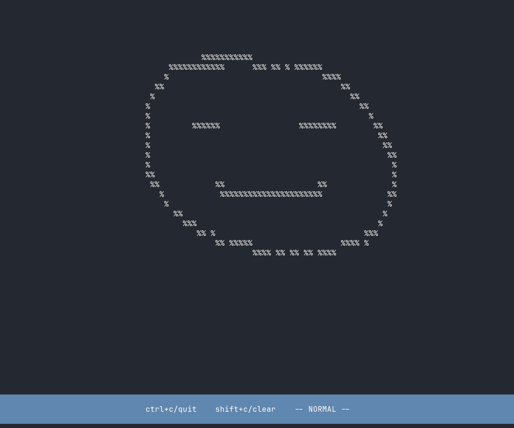

# tsketch

tsketch allows you to draw in your terminal.



## Installation

```bash
# Clone the repository
git clone https://github.com/vinaykulk621/tsketch.git

# Navigate to the project directory
cd tsketch

# Build the application
go build -o tsketch

# Optionally install to /usr/bin to access from anywhere
sudo mv tsketch /usr/bin/

# Run the application
./tsketch
```

## Usage

- Use `i` to enter insert mode (drawing mode)
- Move your mouse to draw on the canvas
- Use `ctrl+c` or `q` to exit insert mode or quit the application
- Use `shift+c` to clear the canvas

---

built using

- [bubbletea](https://github.com/charmbracelet/bubbletea)

